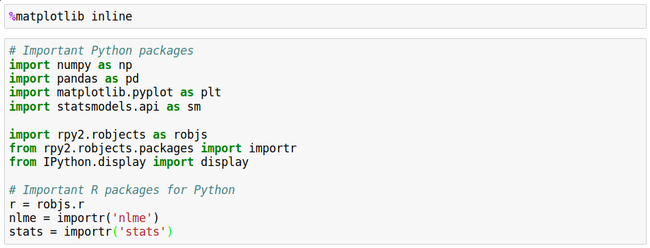

# Introduction to Jupyter
* "Interactive Computing Environment" allowing code, plot, texts, equations, etc. to be created and shared
* Requirements:
    - Python 3.6 (Recommended!) or 2.7 (even if working in R)
    - Web browser
    - Language-specific Kernel (R, Python, or Julia)

## Installing Anaconda:
[Download](https://www.continuum.io/downloads) the binary and follow the instructions.

* Important points:
    - Install the latest version (Python 3.6 or Python 2.7)
    - If you are asked during the installation process wheter you'd like to make Anaconda your default Python installation, say **yes**
    - Otherwise you can accept all of the defaults

* Package Management:
    - The packages in Anaconda ocontain the various scientific libraries used in day to day scientific programming. Anaconda supplies a great tool called ```conda``` to keep your packages organized and up to date.
    - Execute the follwing to update the whole Anaconda distribution:
        1. Open up a terminal
        2. Type ```conda update anaconda```

## Using the R Kernel (For R users)
 Note that Anaconda comes with the Python kernel, but if you are using R, you also need to install the R kernel. For this, go to command line and type:
```
conda install -c r r-essentials
```

### R packages in Python (Optoinal)
Most required packages such as numpy, pandas, scipy, and matplotlib come with the Anaconda installation. However, to use R packages in python you need to install rpy2 and statsmodels packages. You can use the ```conda``` install command in command-line (or the Anaconda prompt in Windows):
```
conda install rpy2
conda install statsmodels
```

* Note about packages for R in python:


## Using R in python: rpy2
* Call R functions directly from Ptyon
* Import R packages with ```importr``` from ```rpy2.robjects.packages```. E.g
    - ```nlme = importr('nlme')```.
* Follow Python syntax for calling functions
    - ```gls()``` -> ```nlme.gls()```.
    - Note dots in names become underscores in Python
        + ```arima.sim()``` -> ```stats.arima_sim()```.
* Function inputs need to be R objects!

## R functions in Python
* Convert variables to R objects and pass to R environment:
```
robjects.globalenv['y'] = robjectss.FloatVector(y)
```
* R formlas are passed using ```r.formula('formula')
    - Note different R packages behave differently. E.g:
        + ```robjects.r.lm()``` does not need ```r.formula()``` in the argument, where as ```nlme.gls()``` does. The return summary of robjects.r and nlme functions are also different.